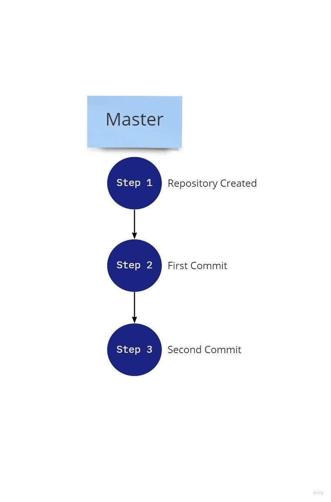
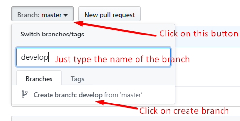
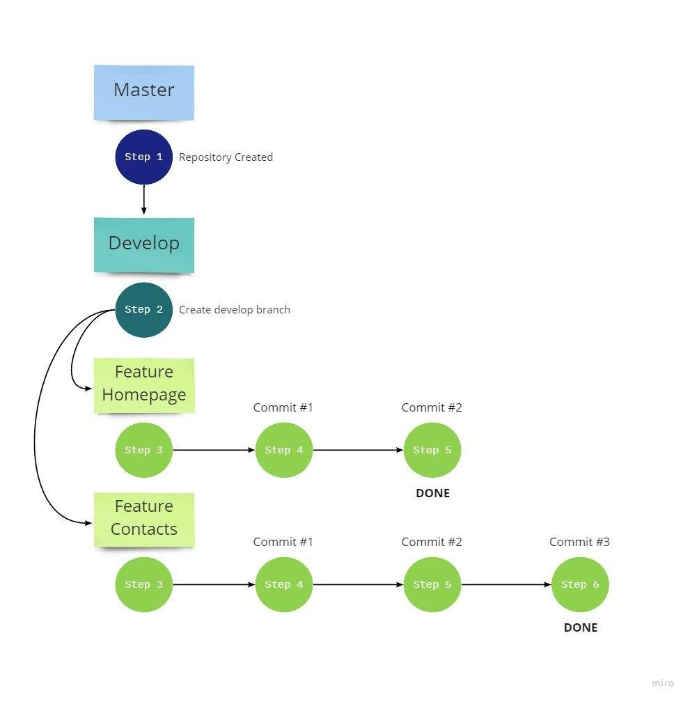
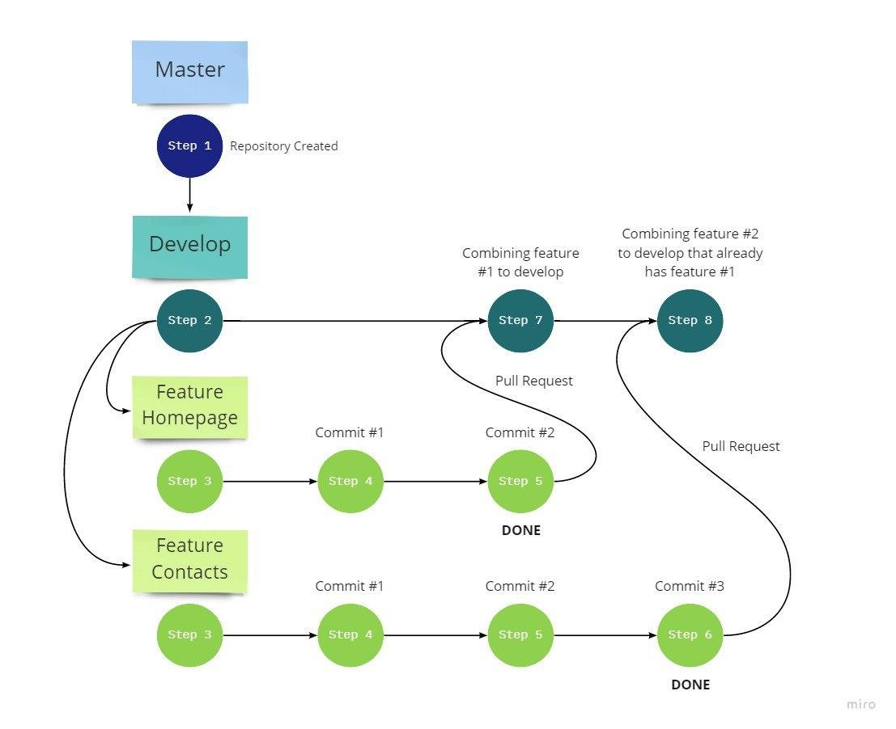

# Branching Strategy

### What is a branch?

When starting work on a GitHub repository, there is always an initial default branch called the **master** branch. You can think of the master branch as a timeline of your code's versions. Each commit creates a new point on this timeline, representing your code's state at that moment.

The master branch is the most important of all branches. It contains the production-ready version of your code - one that is stable, bug-free, and ready for deployment. This is where the final, polished work from all developers in the team comes together.

Below is an image showing how the master branch looks, similar to how you've been using it for your homework submissions!

### Why use different branches? "But I only commit to master!" 🤔

Now that we understand what the master branch is, let's explore why committing directly to it isn't ideal.

In a real development environment, having all team members commit directly to the master branch is impractical and risky. Consider a team of 8 developers - what happens if several developers accidentally introduce bugs? What if we need to roll back to a previous version while preserving current work?

These challenges lead us to a solution: we need a way to separate our development work while still maintaining the ability to combine everything into a single, stable codebase. This is where the **develop** branch comes in. Think of develop as a staging area that parallels the master branch. It's typically created right after repository initialization.

Here's how to create a develop branch:

### How do we use these branches effectively?

Now that we understand both master and develop branches, you might wonder if we should commit to both. The answer is no! The master branch remains untouched since it should only point to stable versions of our software. Interestingly, we don't commit directly to the develop branch either! Let's look at an example to understand why.

**Example 1:**
Consider Anna and John, two developers working on an application. They need to implement two new features for their first sprint. Their team lead has already created the repository and the develop branch. Here's their workflow:

1. Both developers clone the repository to their local machines
2. They switch from master to the develop branch
3. Anna needs to implement the HomePage while John works on the Contacts page
4. From the develop branch, each developer creates their own feature branch
5. Anna creates a `feature_homepage` branch, and John creates a `feature_contacts` branch
6. Each developer works independently on their respective branches, committing changes without interfering with each other's work

### How do we combine our work?

Once developers complete their features, it's time to merge the changes. This is where **pull requests** come into play. A pull request is essentially a request to merge the work from one branch into another - typically from a feature branch into develop.

**Example 2:**

Let's continue with Anna and John's scenario:

- When Anna finishes first, she needs to ensure her branch is up-to-date with develop. She merges develop into her feature branch locally, ensuring she has both the latest develop changes plus her new features.
- Anna creates a pull request from her branch to develop. The team lead reviews her code, providing feedback if needed. Once approved, Anna's work is merged into the develop branch on GitHub.

- When John completes his work, he follows the same process. First, he updates his feature branch with the latest develop changes (which now include Anna's work). Then he creates his pull request for review and eventual merging.

### The Final Step

Once all features are merged into develop and thoroughly tested, someone creates a pull request from develop to master. This represents a new stable version of the application ready for production.

Remember: the version on master is your production-ready code. We keep it separate from ongoing development to ensure stability. For the next sprint, the cycle begins again - create feature branches from develop, implement new features, merge back to develop, and finally to master when ready.

It's a continuous cycle of development that keeps your codebase organized and stable!
