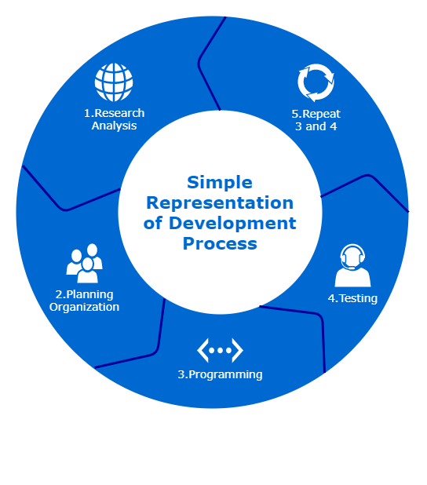

# How to start building a project ☄

All applications are built with a plan and goal in mind. This means that it's a bad idea to just sit there and start slapping code in a document. This approach is not good because we build our app and writing code without the whole picture in mind. This leads to bad, unsalable and unreliable code. That is why we need a good plan to achieving our goals.

## Phases of building an app 🌟

Applications are not built only by coding and drinking coffee. Applications are also built by thinking, researching, planning and testing. All these things are called a development cycle of an application. In order to complete this development cycle, you need to pass these 4 phases:

1. Analyzing and researching
2. Planning and discussion
3. Developing the planned features
4. Testing the code that we have written
5. Repeat 3 and 4 until you get a satisfying result

### Analyzing and research phase 🌟

This is the first phase of any project and this is often overlooked by inexperienced developers since the importance of this phase is highlighted later in the other phases manifesting as not knowing what to do, not having the right information or data and developing an application in the wrong direction. In this phase you need to see what the requirements of the project you are building. After analyzing the requirements we need to write down all the things that we would need in order to start this project. This means that we need to research where to find data for our project, research if it is possible to complete it with the technologies you know or research to find libraries or other means to fulfill the requirements for the project. After you are done with this phase you should have a list of resources, information and data needed to start and continue at a steady course to completing the project

### Planning phase 🌟

In this step we already analyzed the stuff that we need and the requirements for the application. Now we have to plan it. Planning is one of the most important part of the development process. We take the whole problem of building the app and create smaller chunks or tasks that we can complete. In this phase we try and estimate how much time we are going to need, divide the work if we have multiple people in our team and define the order in which we are going to start and build our application. In this phase we can create a plan on a document, on a piece of paper or use a more advanced project management tool. The most important thing is to put priority to the tasks and determine which parts and features of the application are important and create tasks that focus on them first. This way you can build a product that works first and make it work better or make it pretty later.

### Development phase 🌟

In this phase we start coding all the tasks that we have planned and written in the planning phase. So we are building and creating the application here. This means that here, we create a git repository, we add contributors on the repository and everybody start working on their individual tasks and follow the plan. We can always go back and add a task in the planning list if we encounter some feature that we missed in the planning. Remember that you need to commit regularly so that everyone has the latest changes while they are developing.

### Testing phase 🌟

This is a phase where we spend time testing our code and checking if the built product correlates with the requirements. When we encounter a problem, missing requirement or something out of place we go back to the coding phase to fix the problems and then go back to testing. This cycle is done when we are satisfied with the complete product

